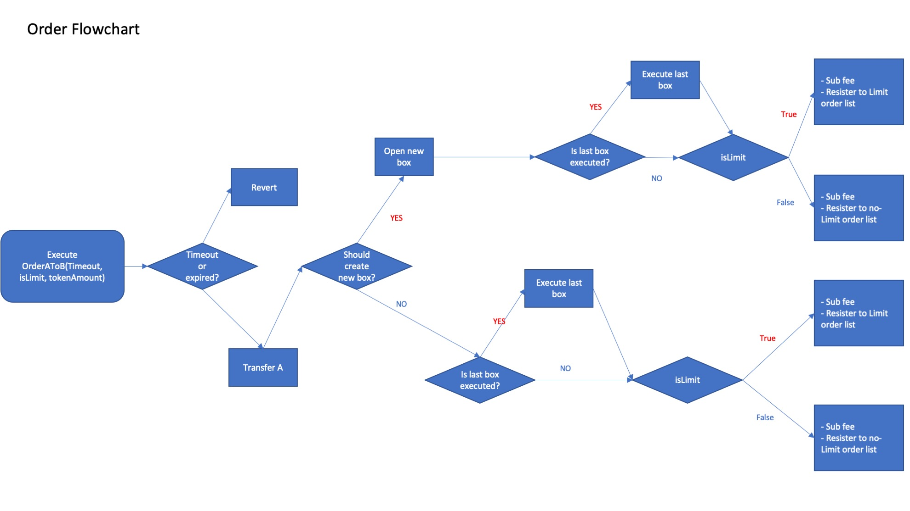
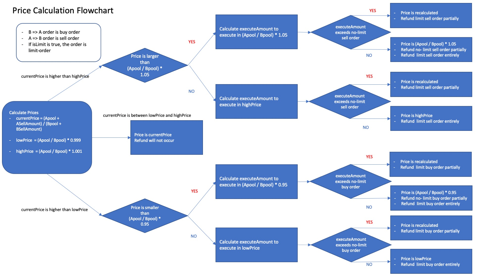

### This is iDOL vs ETH swap 
## What is Fairswap?
- Uniswap-like exchange with a frontrunning protection for option tokens such as LBT.
- All trading-orders in some sequential blocks are collected in "Exchange Box" and are executed in one price regardless of the order recorded in a block.
- User can select Limit order in which funds will be refunded partially or entirely when price moves more than 0.1%, otherwise the order will be executed completely unless price moves more than 5%.
- In a Fairswap which deals with option tokens that fundamentally has a larger volatility than underlying asset, fee price will be adjusted according to the estimated volatility of the option tokens, which is a quite natural practice in traditional option markets.

## Basic architecture of Fairswap

## Some differences from other Fairswaps
- Fee transfer to lien token is paid in both ETH and eth(iDOL)
- Fee for lientoken can be transfered to lien token anytime

## Test
- When you execute test, try using `ganache-cli -b 1` to execute `Promise.all(orders)`

## interfaces
### functions about deployment
- constructor(address _tokenAddress, address payable _lienTokenAddress) public
- function initializeExchange(uint256 _ethAmount, 
                            uint256 _tokenAmount)external

### functions about liquidity
- function removeLiquidity (uint _timeout,
                            uint256 _mineth,
                            uint256 _minTokens,
                            uint256 _sharesBurned) external
- function addLiquidity(uint256 _timeout,
                         uint256 _ethAmount,
                         uint256 _minShares) external isOpen
- function removeAfterMaturity() external

### functions that submit order and execution
- function OrderEthToToken(uint256 _timeout,
                               uint256 _ethAmount,
                               bool _isLimit) isOpen external
- function OrderTokenToEth(uint256 _timeout,
                                 uint256 _tokenAmount,
                                 bool _isLimit) isOpen external
- function excuteUnexecutedBox() public

### function that transfer some part of fee to Lien Token
- function sendFeeToLien() external

### view functions
- function getExchangeData() external view returns 
(uint256, uint256, uint256, uint256, uint256, uint256, uint256, uint256)
- function getShare(address user) external view returns (uint256)
- function getTokenAddress() external view returns (address) 
- function getTokensForLien() external view returns (uint256, uint256)
- function getTotalShare() external view returns (uint256)
- function getPoolAmount() external view returns (uint256, uint256) 
- function getBoxSummary() external view 
                        returns (uint256, uint256, uint256, uint256)
- function getBuyerdata(uint256 place, bool _isLimit) external view
                        returns (address, uint256)
- function getSellerdata(uint256 place, bool _isLimit) external view
                        returns (address, uint256)