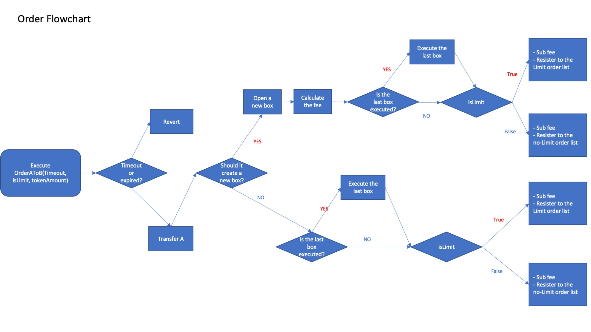
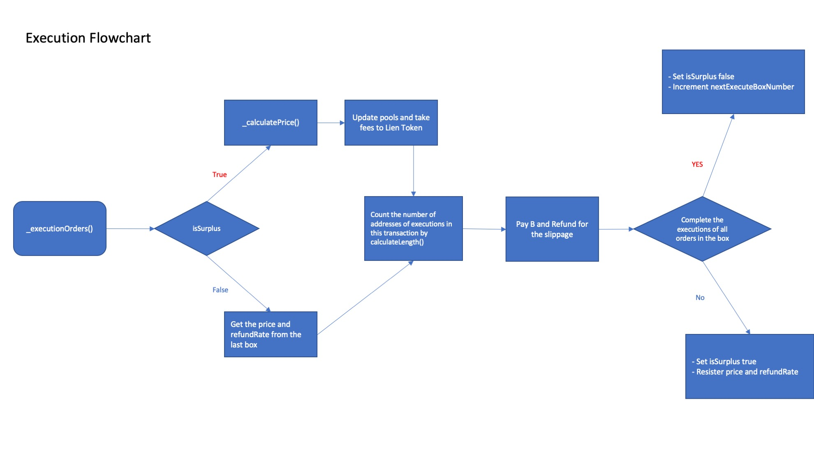
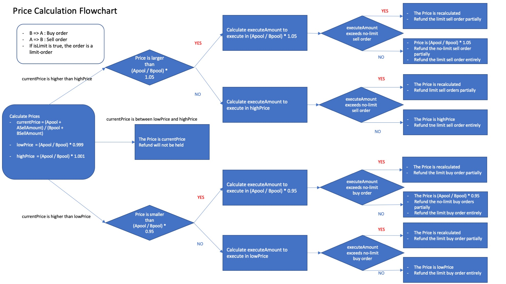
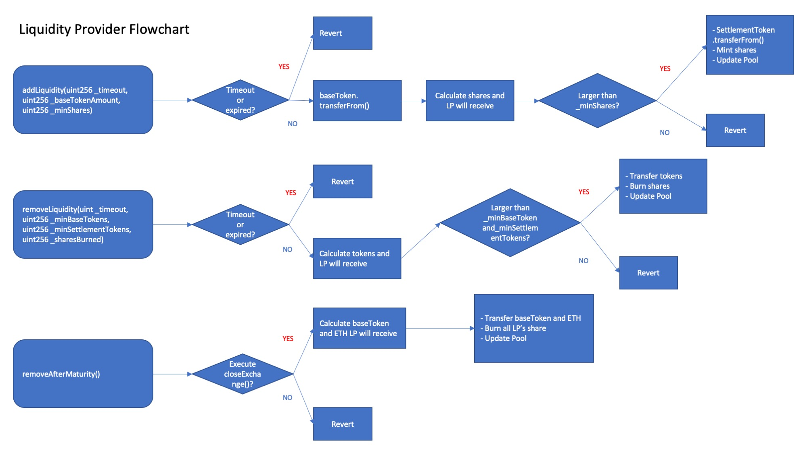

### This is iDOL vs ETH swap 
## What is Fairswap?
- Uniswap-like exchange with a frontrunning protection for option tokens such as LBT.
- All trading-orders in some sequential blocks are collected in "Exchange Box" and are executed in one price regardless of the order recorded in a block.
- User can select Limit order in which funds will be refunded partially or entirely when price moves more than 0.1%, otherwise the order will be executed completely unless price moves more than 5%.
- In a Fairswap which deals with option tokens that fundamentally has a larger volatility than underlying asset, fee price will be adjusted according to the estimated volatility of the option tokens, which is a quite natural practice in traditional option markets.

## Basic architecture of Fairswap

## Contracts
- contracts/ExchangeFactory.sol => This contract launches a new exchange and manages exchanges.
- contracts/BoxExchange.sol => Main contract. This contract records orders and executes them.
- contracts/ShareToken.sol => the ERC20 like token that represents share in the exchange. This token is mintable and burnable from Exchange and uses DecimalSafeMath instead of SafeMath. This token has neither increaseAllowance() nor decreaseAllowance().
- contracts/util/DecimalSafeMath.sol => This contract is almost same as @openzeppelin/contracts/math/SafeMath.sol, but DecimalSafeMath has decimalMul() and decimalDiv() which can calculate multiplication and division of numbers which have 18 digits after the decimal point.

## Some differences from other Fairswaps
- Fee transfer to lien token is paid in both ETH and eth(iDOL)
- Fee for lientoken can be transfered to lien token anytime

## Point of Audit
- Fairswap is different from other DEX like uniswap in the process of price determination and the order execution. 
- In Fairswap, some attacks for transferring tokens or ETH such as Reentrancy attacks because the submission of orders and the executions are split in two or more transactions.
- The points of the audit are the following;
    1. If it is possible to execute one order more than twice and/or to omit executions of some orders
    2. If some attacks could be conducted which force the contract to calculate invalid price or refundrate?
    3. If some attacks could be conducted to let the contract submits and registers invalid orders?
    4. Gas optimization
- Please use price_calculator.xlsx to calculate price, refund rate and fee.(The results may be a little different from those from contracts)

## Test
- When you execute testing, please try using ganache-cli -b 1 to execute Promise.all(orders)

### test_execution.js
- This file tests  if all orders are executed without any excesses or deficiencies.
- In Fairswap, one transaction can execute only ten orders. Thus, an Exchange box which has over 10 orders should be executed in multiple transactions.
- Process of execution is different in following cases.
    1. Some categories of orders such as the Limit buy order has no order
    2. The amount of order is less than 10. (Complete execution in one transaction)
    3. The amount of order is more than 10 and less than 20. (Complete execution in two transactions)
    4. The amount of order is more than 20. (Complete the execution in more than three transactions)
- When the orderer opens the new box while the previous box has already executed, orderer doesn't have to execute orders.

### test_price.js
- This file tests  if the price and the refund rate are calculated correctly and check token transfers.
- Process of the calculation price and the refundRate are different in following cases.
    1. The price moves inner tolerance rate. (No refunds will occur)
    2. The price moves under the tolerance rate, but the inner secure rate and the Buy Limit order can be executed partially (the Buy Limit order will be refunded partially)
    3. The price moves under tolerance rate, but the inner secure rate and Buy Limit order cannot be executed (Buy Limit order will be refunded entirely)
    4. The price moves over the tolerance rate but the inner secure rate, and the Sell Limit order can be executed partially(Sell Limit order will be refunded partially)
    5. The price moves over the tolerance rate but the inner secure rate, and the Sell Limit order cannot be executed (Sell Limit order will be refunded entirely)
    6. The price moves under the secure rate (the Buy no-Limit order will be refunded partially, and the Buy Limit order will be refunded entirely)
    7. The price moves over the secure rate (the Sell no-Limit order will be refunded partially, and the Sell Limit order will be refunded entirely)
    8. The price moves under secure rate, but when all Buy Limit orders are refunded, the price is the inner secure rate (the Buy Limit order will be refunded entirely)
    9. The price moves over the secure rate, but when all Sell Limit orders are refunded, the price is the inner secure rate (the Sell Limit order will be refunded entirely)

### test_exchange.js
- This file tests if the exchange is launched and manipulation about liquidity and order submission is executed correectly.
- Please check revert if the LP can get shares only under _minshare when it executes addLiquidity().
- Please check revert if the LP can get BaseToken only under _minBaseToken when it executes removeLiquidity().
- Please check revert if the LP can get settlementToken only under _minSettlementToken when it executes removeLiquidity().
- Processes of order registrations are different in following cases;
    1. The order is top of the Exchange box (should open new Exchange box)
    2. The exchange box exists, and the orderer has no order in this box
    3. The exchange box exists and the orderer already has the order in this box

### test_transfer_fee.js
- This file tests　if the fee for Lien token is appropriate and it transfers it to Lien token contract correectly.

## Analysis by Mythril
$ myth analyze ./contracts/ExchangeFactory.sol
The analysis was completed successfully. No issues were detected.

## interfaces
### functions about deployment
- constructor(address _tokenAddress, address payable _lienTokenAddress) public
- function initializeExchange(uint256 _ethAmount, 
                            uint256 _tokenAmount)external

### functions about liquidity
- function removeLiquidity (uint _timeout,
                            uint256 _mineth,
                            uint256 _minTokens,
                            uint256 _sharesBurned) external
- function addLiquidity(uint256 _timeout,
                         uint256 _ethAmount,
                         uint256 _minShares) external isOpen
- function removeAfterMaturity() external

### functions that submit order and execution
- function OrderEthToToken(uint256 _timeout,
                               uint256 _ethAmount,
                               bool _isLimit) isOpen external
- function OrderTokenToEth(uint256 _timeout,
                                 uint256 _tokenAmount,
                                 bool _isLimit) isOpen external
- function excuteUnexecutedBox() public

### function that transfer some part of fee to Lien Token
- function sendFeeToLien() external

### view functions
- function getExchangeData() external view returns 
(uint256, uint256, uint256, uint256, uint256, uint256, uint256, uint256)
- function getShare(address user) external view returns (uint256)
- getShareTokenAddress() external view returns (address)
- function getBoxSummary() external view 
                        returns (uint256, uint256, uint256, uint256)
- function getBuyerdata(uint256 place, bool _isLimit) external view
                        returns (address, uint256)
- function getSellerdata(uint256 place, bool _isLimit) external view
                        returns (address, uint256)